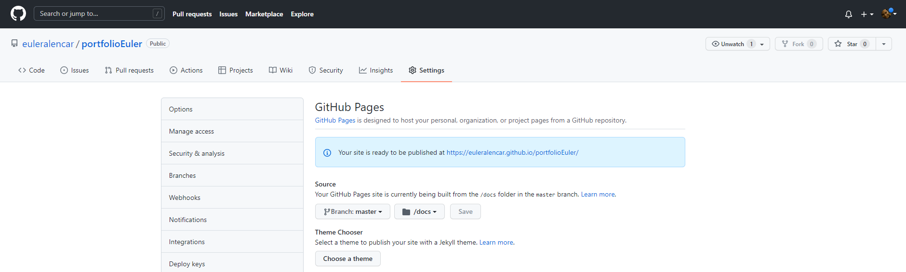
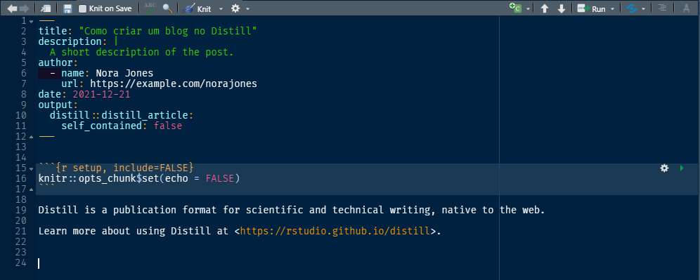

```{r setup, include=FALSE}
knitr::opts_chunk$set(echo = TRUE,
                      eval=FALSE, 
                      message=FALSE, 
                      warning=FALSE, 
                      include=TRUE)
```


## Configuração inicial

```{r config_inicial}
# Comando inicial ---------------------------------------------------------

# passo 1: Instalação dos pacotes essenciaos
install.packages(c("usethis", "distill"))

# passo 2: Criar um novo projeto
usethis::create_project("portfolioEuler")

```

Compare as duas telas do RStudio.

## Configuração do github para criar o blog

```{r config_github}
# Configuranção do Github -------------------------------------------------

#passo 3:
usethis::use_git_config(user.name = "euleralencar",
                        user.email = "euleralencar@gmail.com")

# passo 3.5: Criar o Token no github
usethis::create_github_token()

# passo 3.75: Setar o token no R
gitcreds::gitcreds_set()

# passo 4: Usar o git
usethis::use_git()

# sair do projeto e voltar

# passo 5: Criar o projeto no github
usethis::use_github()

# passo 6: Vai criar a página no Github Pages
usethis::use_github_pages("master", "/docs")
```


Veja no seu github se aparece a mesma tela:


```{r imagem_1, echo=FALSE, eval = TRUE, message=FALSE, warning=FALSE}

```


Crie o arquivo `.nojekyll` e depois use o distill para configurar o ambiente do blog.

```{r usando_distill}
#passo 7:
file.create(".nojekyll")
#list.files(all.files = TRUE)

#passo 8:
distill::create_blog(".", "Portfolio Euler", gh_pages = TRUE)

#passo 9:
distill::create_post("Título do Meu Primeiro Post")

#passo 10: commit e push
# -> Pode comitar diretamente do RStudio

#passo 11: acessar [seu_login].github.io/[seu_repositorio]

```

É possível comitar diretamente do RStudio e dar pull (empurrar) para o Github.

```{r novo_post}

# Criando novo post -------------------------------------------------------

distill::create_post("Como criar um blog no Distill")
```

Ao criar um novo post será criado um rmarkdown deste modelo:


```{r imagem_2, echo=FALSE, eval = TRUE, message=FALSE, warning=FALSE}

```


Após finalizar o processo, dê o commit e suba para o github.


## Algumas referências

- https://themockup.blog/posts/2020-08-01-building-a-blog-with-distill/
- https://rstudio.github.io/distill/blog.html

---

Distill is a publication format for scientific and technical writing, native to the web.

Learn more about using Distill at <https://rstudio.github.io/distill>.

